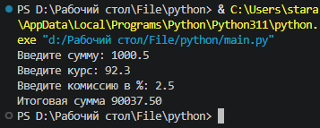

# Конвертер валют с учётом комиссии

Небольшой консольный скрипт на Python: переводит сумму по заданному курсу и сразу учитывает комиссию.

## Формула

```
результат = amount × rate × (1 − commission / 100)
```

Комиссия вычитается из результата, а не прибавляется сверху.

## Требования

- Python 3.6+ (проверено на 3.11)
- Сторонние библиотеки не нужны

## Запуск

```bash
python main.py
```

Скрипт запросит три значения по очереди. Дробная часть вводится через точку.

## Пример сессии

```
Введите сумму: 1000
Введите курс: 95.5
Введите комиссию в %: 2.5
Итоговая сумма 93112.50
```

Расчёт: `1000 × 95.5 × (1 − 0.025) = 93112.50`

## Скриншот



## Описание входных данных

| Переменная   | Описание                  | Пример |
|--------------|---------------------------|--------|
| `amount`     | исходная сумма            | `1000` |
| `rate`       | курс конвертации          | `95.5` |
| `commission` | комиссия в процентах      | `2.5`  |

Результат выводится с двумя знаками после запятой.

## Структура проекта

```
python/
├── main.py        # вся логика: ввод, расчёт, вывод
├── screenshot.png # скриншот работы скрипта
└── README.md      # этот файл
